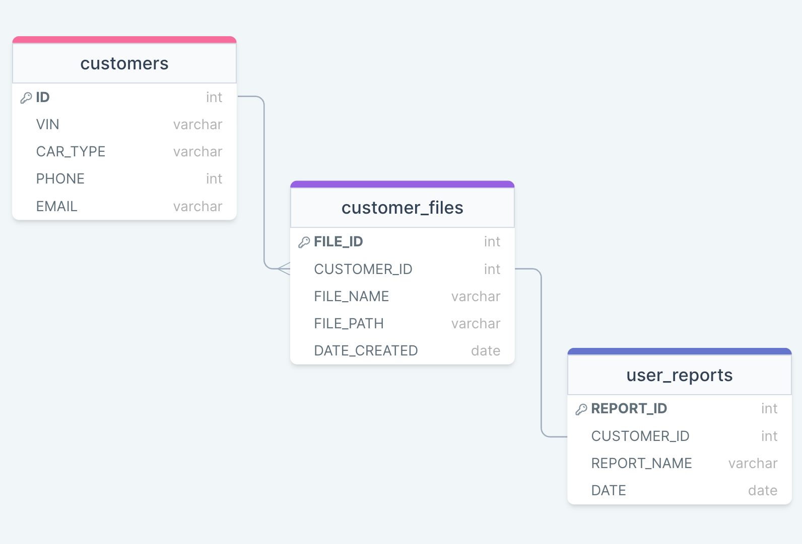

# Project Title

ManuSpec

## Overview

Manuspec is a web application to create, save, and send digitalized automotive inspection reports.

### Problem

This application aims to replace traditional paper-based methods in dealerships. Given the excessive use of paper in such environments, managing documents can be challenging and prone to errors. Reviewing historical vehicle reports is also a time-consuming process. This app seeks to streamline these tasks by digitally storing reports under customer names or IDs, making retrieval as simple as searching for a customer's name. Additionally, it addresses the issue of reaching customers who aren't physically present by offering the option to send reports directly to them.

### User Profile

- Technicians, Service Advisors, Managers:
  - Create service inspection reports digitally
  - Ability to send service inspection to customer
  - Ability to save reports and search for customer/reports
  - Ability to print report if needed

### Features

- User will log into their account to navigate through the application
- User will be able to create a report using provided template
  - Service Safety Inspection
- User will be able to save report, send report to customer, or print a physical copy of report

## Implemetation

### Tech Stack

- React 

- SASS 
- Node  | Express 
- Client libraries:
  - react-router
  - axios
  - react-icons
  - jsPDF
- Server libraries:
  - knex
- Tools:
  - Figma (Create Mockups)

### APIs

- No external APIs will be used for the first sprint

### Sitemap

- Landing Page
  - Login (Sign in to use)
- Dashboard
  - Create Report
    - Finished Report
  - List of Customer History
    - Selected Customer
  - User Profile

### Mockups

#### Home Page

#### Login Page

#### Create a Report Page

#### Customer History Page

#### Selected Customer Page

### Data

### Endpoints

  
<code>GET /customers</code>

##### Parameters

> | name  | type     | data type | description                   |
> | ----- | -------- | --------- | ----------------------------- |
> | id    | required | number    | Specific customer ID          |
> | name  | required | string    | Customer name                 |
> | vin   | required | string    | Vehicle Identification Number |
> | car   | required | string    | Vehicle Make and Model        |
> | phone | required | number    | Customer Phone Number         |
> | email | required | string    | Customer Email                |

##### Responses

> | http status code | response                                                                                                                                         |
> | ---------------- | ------------------------------------------------------------------------------------------------------------------------------------------------ |
> | `200`            | `[{ "id": 1, "name": "Quinn Hughes", "VIN": "1FAHP3F20CL266328", "car": "2015 Honda Civic", "phone": 7788982379, "email": "quinn@canucks.com"}]` |
> | `400`            | `{"code":"400","message":"Bad Request"}`                                                                                                         |

  

 

  
<code>GET /customers/:customerId</code>

##### Parameters

> | name   | type     | data type | description                   |
> | ------ | -------- | --------- | ----------------------------- |
> | id     | required | number    | Specific customer ID          |
> | name   | required | string    | Customer name                 |
> | vin    | required | string    | Vehicle Identification Number |
> | car    | required | string    | Vehicle Make and Model        |
> | phone  | required | number    | Customer Phone Number         |
> | email  | required | string    | Customer Email                |
> | report | required | file      | Customer Service Report       |

##### Responses

> | http status code | response                                                                                                                                                              |
> | ---------------- | --------------------------------------------------------------------------------------------------------------------------------------------------------------------- |
> | `200`            | `[{ "id": 1, "name": "Quinn Hughes", "VIN": "1FAHP3F20CL266328", "car": "2015 Honda Civic", "phone": 7788982379, "email": "quinn@canucks.com", "report": file.pdf }]` |
> | `400`            | `{"code":"400","message":"Bad Request"}`                                                                                                                              |

  
<code>GET /profile</code>

##### Parameters

> | name     | type     | data type | description            |
> | -------- | -------- | --------- | ---------------------- |
> | id       | required | number    | Specific customer ID   |
> | name     | required | string    | Customer name          |
> | tech_num | required | number    | Technician Number      |
> | report   | required | file      | Created Service Report |

##### Responses

> | http status code | response                                                    |
> | ---------------- | ----------------------------------------------------------- |
> | `200`            | `[{ "id": 1, "name": "Quinn Hughes", "report": file.pdf }]` |
> | `400`            | `{"code":"400","message":"Bad Request"}`                    |

  
<code>POST /customers </code>

##### Parameters

##### Responses

  
<code>POST /customers/:id</code>

##### Parameters

##### Responses

  
<code>PUT /customers/:id</code>

##### Parameters

##### Responses

### Auth

- JWT Auth
  - Will implement if there is time - currently "Nice to Have"
  - Before adding auth, all API requests will be using a fake user with id 1
  - Added after core features have first been implemented
  - Add states for logged in showing different UI (URL/user info)

## Roadmap

- Create client
  - React project with routes and boilerplate pages
- Create server
  - Express project with routing, with placeholder 200 responses
- Create migrations
- Create seeds with sample list of customers / reports / users
- Deploy client and server projects so all commits will be reflected in production
- Feature: Log In Page
  - User will sign in to use application
- Feature: Home Page
  - Links to different pages (Reports, Customers, Profile)
- Feature: Reports Page
  - Add form to fill in report
  - Once finished with form, direct to Complete Reports Page
  - Complete Reports Page will show full form as a PDF File
- Feature: Complete Reports Page
  - Create POST /customers/:id (to save under specific customer)
  - Add print file option
  - Add send file to customer option
- Feature: Customers Page
  - GET /customers
  - Customer name will link to Customer Info Page
- Feature: Customer Info Page
  - GET /customers/:id
  - Will show full customer info + saved PDF Files from filled in report
- Feature: User Profile Page
  - GET /profile
  - Will show previous made reports with customer name
  - Clicking on a previous report, will navigate to Complete Reports Page (Save, Print, Send)
- Bug Fixes
- Demo

## Nice-to-haves

- Add image/video upload per report
- Multiple inspection sheet templates
  - Used Car Inspection
  - Out of Province Inspection
  - Pre Delivery Inspection
- Add calendar with functionality
  - Create, delete, update appointments
- Different dashboard layout
  - Widget for calendar
  - Widget for today's appointments
  - Widget for report count
- Login functionality and authorization
