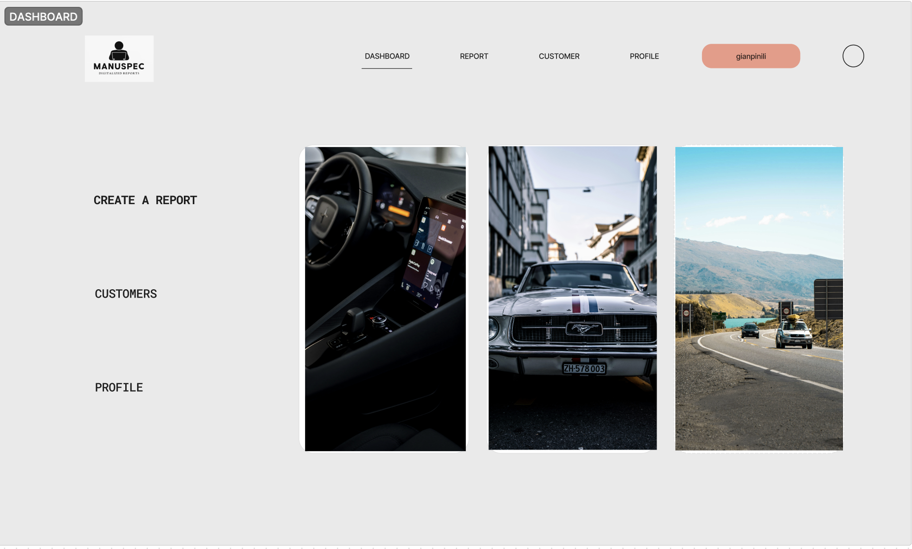
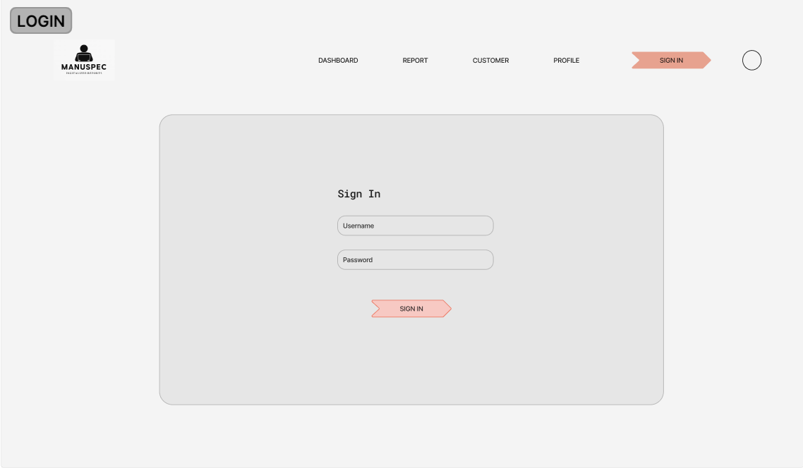
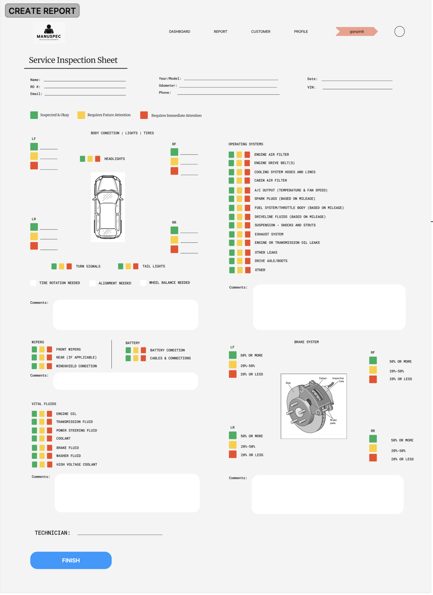
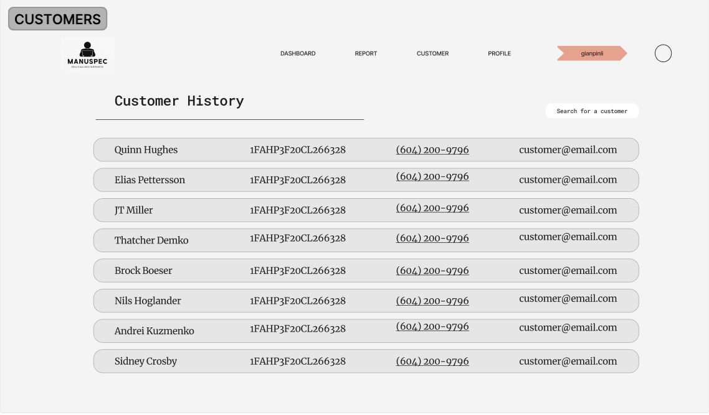
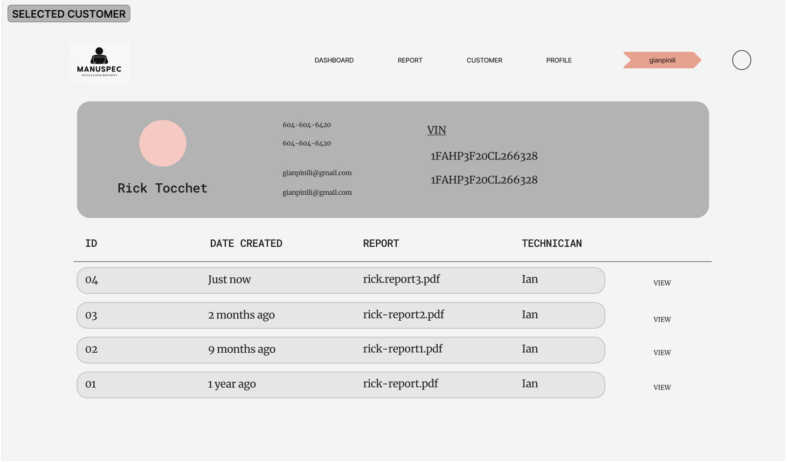

# Project Title

Manuspec

## Overview

Manuspec is a web application to create, save, and send digitalized automotive inspection reports.

### Problem

This application aims to replace traditional paper-based methods in dealerships. Given the excessive use of paper in such environments, managing documents can be challenging and prone to errors. Reviewing historical vehicle reports is also a time-consuming process. This app seeks to streamline these tasks by digitally storing reports under customer names or IDs, making retrieval as simple as searching for a customer's name. Additionally, it addresses the issue of reaching customers who aren't physically present by offering the option to send reports directly to them.

### User Profile

- Technicians, Service Advisors, Managers:
  - Create service inspection reports digitally
  - Ability to send service inspection to customer
  - Ability to save reports and search for customer/reports
  - Ability to print report if needed

### Features

- User will log into their account to navigate through the application
- User will be able to create a report using provided template
  - Service Safety Inspection
- User will be able to save report, send report to customer, or print a physical copy of report

## Implemetation

### Tech Stack

- React 

- SASS  | Tailwind CSS 
- Node  | Express 
- Client libraries:
  - react
  - react-router
  - axios
  - react-icons
- Server libraries:
  - knex
  - express

### APIs

- No external APIs will be used for the first sprint

### Sitemap

- Landing Page
  - Login (Sign in to use)
- Dashboard
  - Create Report
    - Finished Report
  - List of Customer History
    - Selected Customer
  - User Profile

### Mockups

#### Home Page

#### Login Page

#### Create a Report Page

#### Customer History Page

#### Selected Customer Page

### Data

### Endpoints

  
<code>GET /customers<code>

  ##### Parameters

  ##### Responses
  

  
<code>GET /customers/:customerId<code>

  ##### Parameters

  ##### Responses

  
<code>GET /profile<code>

  ##### Parameters

  ##### Responses

  
<code>POST /customers <code>

  ##### Parameters

  ##### Responses

  
<code>POST /customers/:id<code>

  ##### Parameters

  ##### Responses

  
<code>PUT /customers/:id<code>

  ##### Parameters

  ##### Responses

### Auth

### Roadmap

- Create client

  - React project with routes and boilerplate pages

- Create server

  - Express project with routing, with placeholder 200 responses

- Create migrations

- Create seeds with sample list of customers / reports / users

- Deploy client and server projects so all commits will be reflected in production

- Feature:

- Feature: Home Page

- Feature:

- Feature:

- Feature:

- Bug Fixes

- Demo

## Nice-to-haves

- Add image/video upload per report
- Multiple inspection sheet templates
  - Used Car Inspection
  - Out of Province Inspection
  - Pre Delivery Inspection
- Add calendar with functionality
  - Create, delete, update appointments
- Different dashboard layout
  - Widget for calendar
  - Widget for today's appointments
  - Widget for report count
- Login functionality and authorization